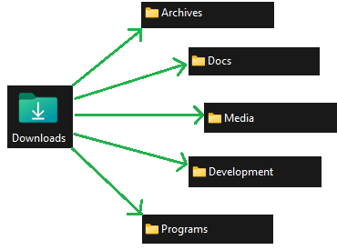

# 📂 AutoSort

## 🔍 Overview
AutoSort is a desktop automation tool that monitors a selected folder (default: **Downloads**) and automatically moves files to categorized destination folders based on their file extensions. It runs in the **system tray**, allowing users to control sorting operations easily.

---

## 🛠 File Sorting Flow Diagram


## ⚡ Installation

### **1️⃣ Clone the Repository**
```sh
git clone https://github.com/yourusername/AutoFileSort.git
cd AutoFileSort
```

### **2️⃣ Install Dependencies**
```sh
pip install -r requirements.txt
```

### **3️⃣ Run the Script**
```sh
python main.py
```

---

## 🔧 Convert to an Executable (.exe)

To create a standalone **.exe** file using PyInstaller:

```sh
pyinstaller --onefile --windowed --icon=icon.ico main.py
```
- `--onefile`: Bundles everything into a single executable.
- `--windowed`: Hides the console window.
- `--icon=icon.ico`: Adds a custom icon (replace with your icon file).

The **executable** will be found in the `dist/` folder.

---

## 🖥️ Auto-Start on Windows (Startup Folder)
1. **Generate the .exe file** (see above).
2. **Open Run Dialog** (`Win + R`), type:
   ```
   shell:startup
   ```
   and press **Enter**.
3. **Copy the .exe** from the `dist/` folder and paste it into the **Startup** folder.

Your script will now start automatically when Windows boots.

