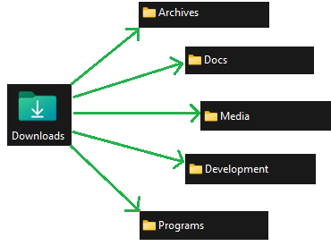
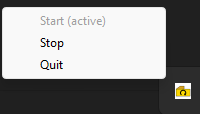

# 📂 AutoSort

## 🔍 Overview
AutoSort is a **desktop automation tool** that monitors a selected folder (default: **Downloads**) and automatically moves files to categorized destination folders based on their file extensions. 
It also includes a **system tray** icon, allowing users to start and stop sorting operations easily.

### 📁 Default Folder Structure
AutoSort organizes files into the following default folders/categories, and checks for the following extensions (feel free to add any additional extensions you may need beyond these).

- **Docs**: `.pdf`, `.docx`, `.xlsx`, `.pptx`, `.txt`, `.csv`, `.dotx`, `.doc`, `.ppt`, `.potx`, `.text`
- **Media**: `.jpg`, `.jpeg`, `.png`, `.gif`, `.mp4`, `.mov`, `.mp3`, `.wav`, `.webm`, `.svg`, `.webp`, `.ico`, `.m4a`
- **Archives**: `.zip`, `.rar`, `.tar`, `.gz`, `.7z`
- **Programs**: `.exe`, `.msi`, `.dmg`, `.pkg`, `.sh`, `.iso`
- **Development**: `.py`, `.js`, `.html`, `.css`, `.cpp`, `.java`, `.sh`, `.ipynb`, `.json`, `.md`, `.m`, `.drawio`, `.ts`, `.log`, `.apk`, `.db`, `.sqlite`, `.sql`

### ✏️ Custom File Types Configuration
File type categories live in [`config/file_types.json`](config/file_types.json). The file contains a simple JSON object where each key is a category name and its value is a list of extensions:

```json
{
  "Docs": [".pdf", ".txt"],
  "Media": [".jpg", ".mp4"]
}
```

Add new categories or extensions by editing this file. AutoSort reads the configuration at start-up and creates matching folders on your Desktop if needed. If the file is missing or invalid, the built-in default mappings shown above are used.

#### 🎭 Meme Pop-Up Feature
For personal use, AutoFileSort includes a **meme pop-up feature** that triggers when an image/media file is detected in the **Downloads** folder. 
- "**Yes**" → The file is automatically moved to a `Meme` folder inside the `Media` folder
- "**No**"  → The file is moved into the `Media` folder.


- **This feature can be disabled** by setting the boolean `meme_enabled = False` in the code.
---

## 🛠 File Sorting Flow Diagram


---

## 🎛 System Tray Functionality
AutoSort provides a **system tray icon** with the following options:
- **Start** - Begins monitoring the default folder (default: **Downloads**).
- **Stop** - Pauses file sorting.
- **Quit** - Exits the application.

The current state is indicated by:
1. The disabled menu option (e.g., `Start (active)` when running).
2. The text `(active)` is added next to the current state.



---

### 🔔 Notification Customization

AutoSort uses [win11toast](https://pypi.org/project/win11toast/) for native
Windows toast notifications. You can tweak how the popup looks by passing
additional keyword arguments to `show_notification`, which forwards them to
`win11toast.notify`. For example:

```python
show_notification(
    "Download complete",
    title="AutoSort",
    icon="https://unsplash.it/64?image=669",
    duration="long",
)
```

Refer to the [win11toast documentation](https://github.com/gruhn/win11toast)
for more customization options such as images, buttons, or input fields. By
default, the standard Windows notification sound is used.

---

## ⚡ Installation

To ensure a clean environment and avoid dependency conflicts, it's recommended to use a **virtual environment (venv)**. 
This isolates the project's dependencies from your system-wide Python installation.

### **1️⃣ Clone the Repository**
```sh
git clone https://github.com/Marcus-Gustafsson/AutoFileSort.git
cd AutoFileSort
```

### **2️⃣ Create a Virtual Environment**
```sh
python -m venv .venv
```
- This creates a **`.venv`** folder that contains a self-contained Python environment for the project.

### **3️⃣ Activate the Virtual Environment**
- **Windows (Command Prompt):**
  ```sh
  .venv\Scripts\activate
  ```
- **Windows (PowerShell):**
  ```sh
  .venv\Scripts\Activate.ps1
  ```
- **Mac/Linux (Bash):**
  ```sh
  source .venv/bin/activate
  ```

### **4️⃣ Install Dependencies**
```sh
pip install -r requirements.txt
```

### **5️⃣ Run the Script**
```sh
python main.py
```

---

## 🖥️ Auto-Start on Windows (Startup Folder)

To make AutoFileSort launch automatically when Windows starts, follow these steps:

### **1️⃣ Create a Batch Script**
This script will activate the virtual environment and run AutoFileSort.

1. Open **Notepad** and paste the following:
   ```batch
   @echo off
   cd /d "C:\path\to\your\AutoFileSort"
   call .venv\Scripts\activate
   start "" pythonw main.py
   exit
   ```
   - Replace `C:\path\to\your\AutoFileSort` with the actual path to the **AutoFileSort** folder.

2. Save the file as e.g. **`Run_AutoFileSort.bat`** in the **AutoFileSort** directory.

### **2️⃣ Add the Script to the Windows Startup Folder**
1. Press **`Win + R`**, type:
   ```sh
   shell:startup
   ```
   and press **Enter**.
2. **Copy `Run_AutoFileSort.bat`** into the **Startup** folder.

AutoFileSort will now **automatically start** every time Windows boots.

