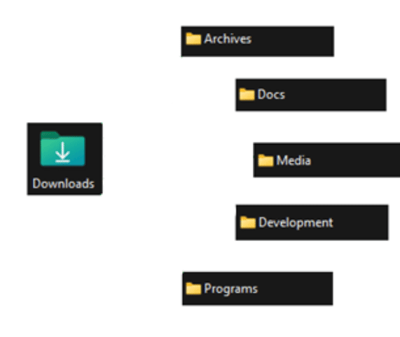

# 📂 AutoSort

## Overview
AutoSort monitors a folder (Downloads by default) and moves new files into category folders based on their extensions. A system tray icon provides Start, Stop, and Quit controls, and an optional menu pop-up lets you decide where to file images.



### Categories
Docs, Media, Archives, Programs, and Development. Edit or add extensions in [`config/file_types.json`](config/file_types.json).

## Installation
Requires [uv](https://docs.astral.sh/uv/install).
```sh
git clone https://github.com/Marcus-Gustafsson/AutoSort.git
cd AutoSort
uv sync --dev
uv run python main.py
```
`uv` automatically creates and uses a `.venv`.

## Auto-start on Windows (no console window)

Use the helper script (in `scripts/`) to create a **Startup shortcut** that launches AutoSort.

**From the repo root, run:**
```powershell
powershell -ExecutionPolicy Bypass -NoProfile -File scripts\create_autosort_shortcut.ps1
```
*(or right-click the script → Run with PowerShell)*

**Follow the prompts:**
1. The script ensures .venv exists (runs uv sync if needed)
2. It creates Run_AutoSort.lnk targeting .venv\Scripts\pythonw.exe main.py.
3. It can copy the shortcut to your Startup folder (auto-run at logon).
4. It shows a message, waits briefly, then opens Startup in Explorer and highlights the new shortcut.
_(Optionally removes the repo copy after copying, i.e., “move” it)_

Tip: You can re-run the script anytime to recreate/move a new shortcut

**Requirement: [uv](https://docs.astral.sh/uv/install) must be installed.**

## System Tray & Notifications
The tray menu provides Start, Stop, and Quit actions. Windows users receive toast notifications via win11toast.
