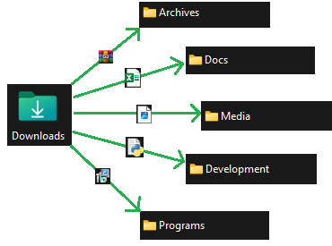

# 📂 AutoFileSort

## 🔍 Overview
AutoSort is a **desktop automation tool** that monitors a selected folder (default: **Downloads**) and automatically moves files to categorized destination folders based on their file extensions. 
It also includes a **system tray** icon, allowing users to start and stop sorting operations easily.

### 📁 Default Folder Structure
AutoFileSort organizes files into the following default folders/categories and checks for the following extensions (feel free to add whatever extension you might need beyond these.)

- **Docs**: `.pdf`, `.docx`, `.xlsx`, `.pptx`, `.txt`, `.csv`, `.dotx`, `.doc`, `.ppt`, `.potx`
- **Media**: `.jpg`, `.jpeg`, `.png`, `.gif`, `.mp4`, `.mov`, `.mp3`, `.wav`, `.webm`, `.svg`, `.webp`, `.ico`
- **Archives**: `.zip`, `.rar`, `.tar`, `.gz`, `.7z`
- **Programs**: `.exe`, `.msi`, `.dmg`, `.pkg`, `.sh`, `.iso`
- **Development**: `.py`, `.js`, `.html`, `.css`, `.cpp`, `.java`, `.sh`, `.ipynb`, `.json`, `.md`, `.m`, `.drawio`, `.ts`, `.log`

#### 🎭 Meme Pop-Up Feature
For personal use, AutoFileSort includes a **meme pop-up feature** that triggers when an image/media file is detected in the **Downloads** folder. 
- "**Yes**" -> The file is automatically moved to a `Meme` folder inside the `Media` folder
- "**No**"  -> The file is moved into the `Media` folder.


- **This feature can be disabled** by setting the boolean `meme_enabled = False` in the code.
---

## 🛠 File Sorting Flow Diagram


---

## 🎛 System Tray Functionality
AutoSort provides a **system tray icon** with the following options:
- **Start** - Begins monitoring the default folder (default: **Downloads**).
- **Stop** - Pauses file sorting.
- **Quit** - Exits the application.

The current state is indicated by:
1. The disabled menu option (e.g., `Start (active)` when running).
2. The text `(active)` added next to the active state.


---

## ⚡ Installation

### **1️⃣ Clone the Repository**
```sh
git clone https://github.com/yourusername/AutoFileSort.git
cd AutoFileSort
```

### **2️⃣ Install Dependencies**
```sh
pip install -r requirements.txt
```

### **3️⃣ Run the Script**
```sh
python main.py
```

---

## 🔧 Convert to an Executable (.exe)

To create a standalone **.exe** file using PyInstaller:

```sh
pyinstaller --onefile --windowed --icon=icon.ico main.py
```
- `--onefile`: Bundles everything into a single executable.
- `--windowed`: Hides the console window.
- `--icon=icon.ico`: Adds a custom icon (replace with your own).

The **executable** will be located in the `dist/` folder.

---

## 🖥️ Auto-Start on Windows (Startup Folder)

1. **Generate the .exe file** (see above).
2. **Open Run Dialog** (`Win + R`), type:
   ```sh
   shell:startup
   ```
   and press **Enter**.
3. **Copy the .exe** from the `dist/` folder and paste it into the **Startup** folder.

AutoFileSort will now launch automatically when Windows starts.
